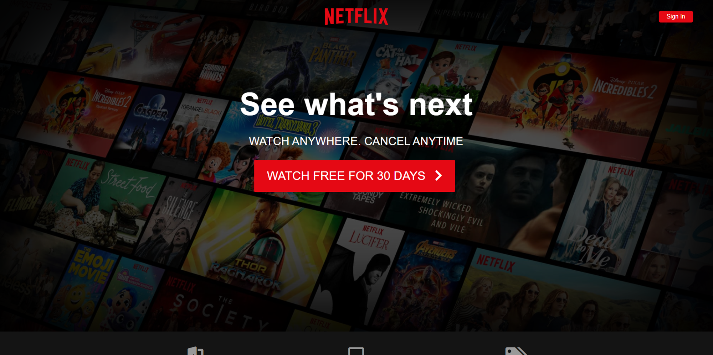
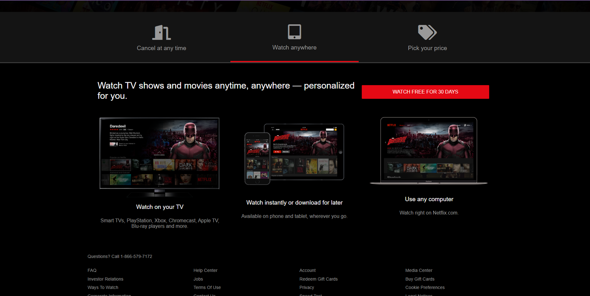

# Netflix Clone using HTML, CSS, and JavaScript

## Description
This project is a simple clone of the Netflix user interface, created to solidify knowledge in web development using only HTML, CSS, and JavaScript. The primary goal is to reproduce the visual appearance and general layout of the Netflix homepage.

## Features
- **Similar User Interface:** Aims to replicate the structure and design of the Netflix homepage.
- **HTML, CSS, and JavaScript:** Developed exclusively using these technologies, without utilizing external frameworks or libraries.
- **Reinforcement of Concepts:** Ideal for consolidating knowledge in layout, CSS styles, and DOM manipulation with JavaScript.

## Functionality
- **Tab Content:** Display different content depending on the current tab.
- **Responsive Design:** Adaptation to different screen sizes for a consistent user experience.

## Usage
1. Clone this repository: `git clone https://github.com/MosqueraSt3/netflix-clone.git`
2. Open the `index.html` file in your preferred web browser.

## Technologies Used
- **HTML:** Content structure.
- **CSS:** Styling and interface design.
- **JavaScript:** Dynamic content manipulation and behavior.

## Screenshots

